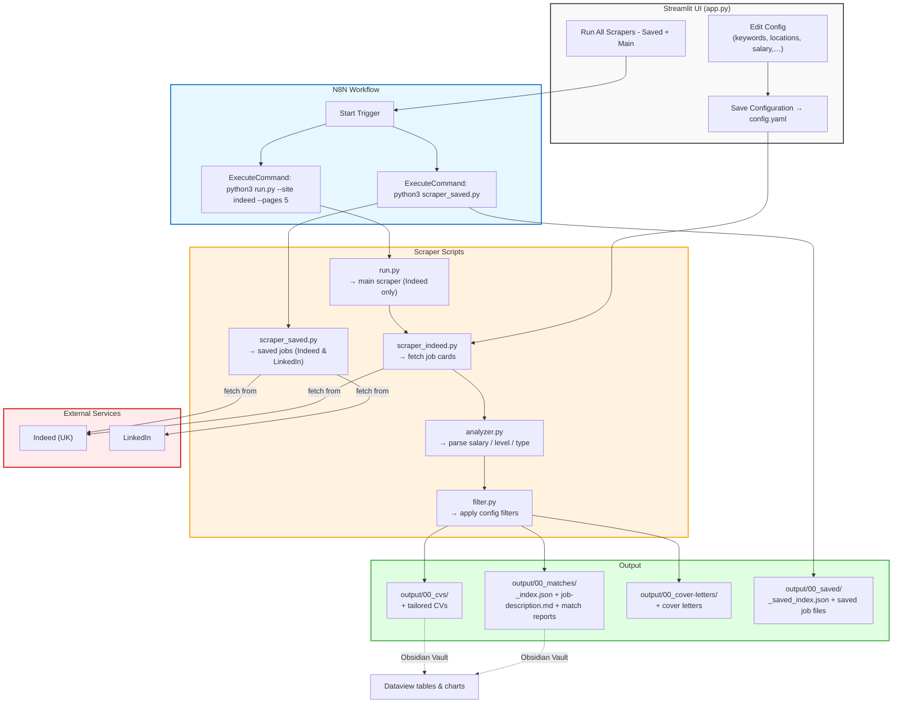

# Job Scraper Pipeline — Design Spec

## Purpose

Build a local, self-hosted job scraping system that:

1. **Searches** job boards with user-defined keywords
2. **Scrapes** all matching listings in bulk
3. **Analyzes** each job (salary, seniority, type)
4. **Filters** based on your preferences
5. **Generates** `job-description.md` files for the cover letter pipeline

---

## Architecture

```
┌─────────────────────────────────────────────────────────┐
│                     config.yaml                         │
│  (keywords, locations, filters, sites)                  │
└────────────────────┬────────────────────────────────────┘
                     │
                     ▼
┌─────────────────────────────────────────────────────────┐
│                      run.py                             │
│              (orchestration layer)                      │
└──────┬──────────────────────────────┬───────────────────┘
       │                              │
       ▼                              ▼
┌──────────────┐              ┌──────────────┐
│ scraper_     │              │ scraper_     │
│ indeed.py    │              │ linkedin.py  │
└──────┬───────┘              └──────┬───────┘
       │                              │
       ▼                              ▼
┌─────────────────────────────────────────────────────────┐
│                    analyzer.py                          │
│  (salary parsing, level detection, type classification) │
└────────────────────┬────────────────────────────────────┘
                     │
                     ▼
┌─────────────────────────────────────────────────────────┐
│                     filter.py                           │
│  (apply config filters, return pass/fail + reason)      │
└────────────────────┬────────────────────────────────────┘
                     │
                     ▼
┌─────────────────────────────────────────────────────────┐
│                 output/job-description.md               │
│  (ready for cover letter generator)                     │
└─────────────────────────────────────────────────────────┘
```

---

## Data Flow

```
1. User sets keywords + locations in config.yaml
2. run.py orchestrates the pipeline
3. scraper_indeed.py fetches jobs from Indeed UK
4. scraper_linkedin.py fetches jobs from LinkedIn (optional)
5. analyzer.py extracts structured data from each job
6. filter.py applies user preferences
7. Each passing job is saved as:
   output/00_matches/{Company}_{Title}/job-description.md
8. Match reports saved to output/00_matches/*_match.md
9. Tailored CVs saved to output/00_cvs/*_CV.md
10. Cover letters saved to output/00_cover-letters/cover_letter_*.md
11. Cover letter generator reads these files
```

---

## Key Design Decisions

### Why Playwright over requests?
- Indeed blocks simple HTTP requests with Cloudflare
- Playwright with stealth config bypasses bot detection
- LinkedIn requires a real browser session

### Why URL navigation over clicking?
- Clicking can trigger anti-bot measures
- Direct URL navigation is more reliable
- Preserves search context across pages

### Why local-first?
- No API keys required
- No cloud service dependencies
- Works offline (once jobs are scraped)
- Easy to version control with Git

---

## Current Status

| Component | Status | Notes |
|-----------|--------|-------|
| `config.yaml` | ✅ Ready | Keywords, locations, filters |
| `run.py` | ✅ Ready | Main entry point |
| `scraper_indeed.py` | ✅ Working | Tested with 136 jobs |
| `scraper_linkedin.py` | 🟡 Partial | Needs login on first run |
| `analyzer.py` | ✅ Ready | Salary, level, type detection |
| `filter.py` | ✅ Ready | Config-based filtering |
| `output/00_matches/` | ✅ Working | Creates `job-description.md` + match reports per job |
| `output/00_cvs/` | ✅ Working | Creates tailored CVs per job |
| `output/00_cover-letters/` | ✅ Working | Creates cover letters per job |
| `output/00_saved/` | ✅ Working | Creates saved jobs index + job files |

---

## Known Issues

1. **LinkedIn scraper** requires manual login — no auto-login yet
2. **Indeed pagination** can be flaky — sometimes stops at page 1
3. **Salary parsing** only handles GBP, not EUR/USD
4. **Duplicate detection** is per-site only (same job on Indeed + LinkedIn = duplicate)
5. **Remote filtering** is basic — "Remote" in title ≠ remote-friendly

---

## Next Steps for Another Agent

1. **Fix pagination** — Ensure `--pages 5` actually fetches 5 pages
2. **Add LinkedIn login flow** — Guide user through first-run authentication
3. **Improve salary parsing** — Handle GBP, EUR, USD, hourly rates
4. **Add CLI flags** — `--dry-run`, `--export-dir`, `--format=json|csv`
5. **Build cover letter generator** — Read `job-description.md` + CV → generate tailored letter
6. **Add scoring** — Rank jobs by relevance to your skills (skills.md matching)

---

## Integration Points

### With `00-about.md`
- Your core profile, philosophy, timeline
- Used for the "About Me" section of CVs

### With `skills.md`
- Skill matrix for relevance scoring
- Match job requirements against your skills

### With `career/`
- Each company folder contains:
  - `job-description.md` (from scraper)
  - `CV_...md` (tailored CV)
  - `Cover-Letter_...md` (generated letter)

---

## Commands for Testing

```bash
# Quick test (one keyword, one page)
python3 run.py --site indeed --pages 1

# Full scrape
python3 run.py --site indeed --pages 5

# Check output
ls output/00_matches/ | head -20
cat output/_index.json | jq '.[].title'
```

---

## Environment

- Python 3.12
- Playwright (Chromium)
- PyYAML
- BeautifulSoup4
- lxml



