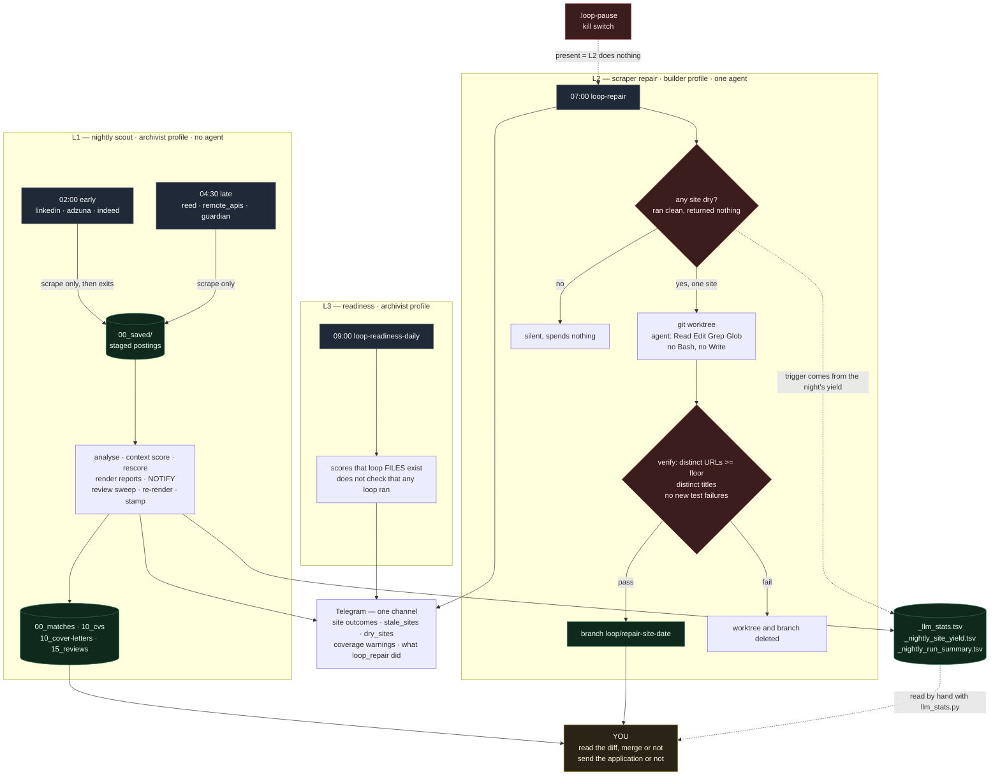
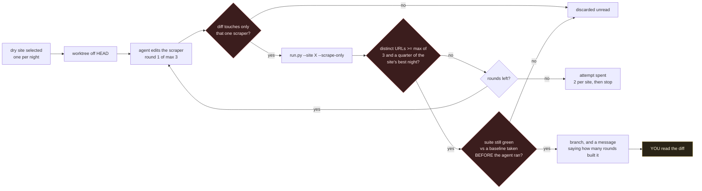

# Loop Configuration — Job Intelligence System

Two loops run unattended. They are different levels and the difference matters:
the nightly produces documents and stops, the repair loop changes source code.

| Loop | Schedule (JST) | In UK terms | Level | Profile | Job |
|------|----------------|-------------|-------|---------|-----|
| Nightly scout — early | `0 2 * * *` | 18:00 BST, previous day | L1 | archivist | `45feb3a6d61c` |
| Nightly scout — late | `30 4 * * *` | 20:30 BST, previous day | L1 | archivist | `59283aceccaa` |
| Scraper repair | `0 7 * * *` | 23:00 BST, previous day | **L2 — edits code, stops at a branch** | builder | `9610debe9fa6` |

**The machine is `Asia/Tokyo`, so every cron expression here is JST and
"nightly" means the Japanese night.** The job market is British, which puts the
scrape at UK early evening — after the working day, with everything posted that
day already up. Nobody chose it for that reason and it happens to be the right
end of the day to scrape a UK board from.

The consequence to remember is that a UK-morning posting is picked up the same
evening, and the Telegram summary lands around 06:30 JST — which is 22:30 the
previous evening in the UK. Reading "the loop ran overnight" as UK overnight
gets the day wrong by one.

The scheduler is Hermes, not the system crontab and not systemd. Jobs live in a
profile, so `crontab -l`, `systemctl --user list-timers` and a bare
`hermes cron list` all show nothing — that last one reads the default profile
only, and each profile has its own `cron/jobs.json`. A job only fires if its
profile's gateway is running, because the ticker is in-process.

```bash
HERMES_HOME=/home/kz003/.hermes/profiles/archivist hermes cron list
HERMES_HOME=/home/kz003/.hermes/profiles/builder   hermes cron list
systemctl --user is-active archivist-gateway.service builder-gateway.service
```

Two paused copies exist and must stay paused: `20e08388d5df` (default profile)
and `74bac7a999d0` (archivist, the pre-split single slot). Either one running
alongside the split would put two pipelines on one `_analyzed.json`.

---

## The shape of it

Three scheduled things run against this repo. Only one of them writes code, and
none of them finishes a decision — every path ends at a human or at a file a
human reads. Times are JST; the machine is `Asia/Tokyo`.



Read the picture for two things.

**Every arrow into `YOU` is a stop, not a handoff.** L1 ends at generated
documents; nothing sends them. L2 ends at a branch; nothing merges it. The
system has no path to the outside world that does not pass through a person.

**L2 is one narrow arrow.** It fires only when a scraper ran clean and returned
nothing, touches one scraper file, and is discarded unread if the diff reaches
anything else. It has never fired in production — `git branch --list "loop/*"`
is empty — because nothing has broken. Dormant is the expected state.

The loop that has actually changed this system is not on the diagram, because it
runs on human attention rather than on cron: something gets measured into
`_llm_stats.tsv` or into `STATE.md`, a person reads it, and a change follows.
Every weight, gate and provider decision in the git log arrived that way. The
scheduled loops feed it; they do not replace it.

### L2 in detail

The gate is the whole design, so it is worth seeing on its own. `count > 0` was
the first version, and an agent passes that by fabricating one record.



The round count is on the branch message deliberately: the worktree is not reset
between rounds, so a branch built in two rounds can carry round one's wrong edit
beside round two's fix, and nothing rejects a leftover that merely looks
harmless. No production branch has been built in two rounds yet. The first one
is worth reading closely.

## L1 — the nightly scout

### The script

```
/home/kz003/.hermes/profiles/archivist/scripts/job_scout_nightly.sh
```

The **profile's** script directory. A stale same-named file at
`~/.hermes/scripts/job_scout_nightly.sh` is called by nothing; editing it
changes nothing.

`no_agent: true` — no model drives the run. The script is the loop. Its stdout
**is** the Telegram message, so only `nightly_scout.py` may print to stdout.
Empty stdout = silent night.

The repo's `run_cron.sh` is the manual/foreground equivalent. Its own header
explains why it must never be scheduled.

### Phases

Six browser-scraped sites did not fit one window, so the night is two slots.
`job_scout_early.sh` and `job_scout_late.sh` are thin wrappers that pass the
phase; Hermes stores `script` as a filename and resolves it as one, so an
argument on the job would be looked up verbatim and fail.

| Phase | Sites | Then |
|-------|-------|------|
| `early` 02:00 | linkedin, adzuna, indeed | nothing — exits |
| `late` 04:30 | reed, remote_apis, guardian | analyse, score, notify, sweep |
| `all` (default) | all six | the whole night in one process |

Two things are split rather than duplicated. `late` does not truncate the run
summary, the yield file or the stats file — truncating there would erase the
early slot's three sites, and `nightly_scout` reads the summary to report which
sites ran. And `early` exits before `notify()`, because notify diffs against
`_nightly_state.json` and then writes tonight's URLs into it: an early
notification would mark this slot's jobs seen and leave the late slot with
nothing new to report.

### Stages

Each `run_site` call passes `--scrape-only`, so a site stages what it found and
stops. Without it, `run.py` merges `00_saved` and then analyses, matches and
generates for **every** new job in the pool — six calls meant six analysis
passes over an accumulating backlog, and each site's timeout killed shared work
part-way.

After the scrapes: analyse staged jobs (one pass, 5400s) → LLM context pass →
persona rescore → re-render match reports → **notify** → review backlog sweep →
re-render (post-sweep) → stamp flag dates → per-stage LLM cost summary.

### Budgets

| Constant | Value | Governs |
|----------|-------|---------|
| `SITE_TIMEOUT` | 1500s | one ordinary site |
| `INDEED_TIMEOUT` / `LINKEDIN_TIMEOUT` | 2400s | the two slow ones |
| `MIN_SITE_SECONDS` | 180s | below this remaining, a site is skipped (exit 125) |
| `DEADLINE` | early 6600s / late 3600s / all 5400s | all scraping |
| `POST_DEADLINE` | late 5400s / else 6600s | the stages after scraping |
| `SWEEP_DEADLINE` | now + 7020s | the whole run |
| `script_timeout_seconds` | 7200 | Hermes kills the job here |

The 180s between `SWEEP_DEADLINE` and the Hermes cap is the entire safety
margin, and it has been crossed: on 2026-08-14 Hermes recorded `Script timed out
after 7200s` at 04:00:25 and stopped listening, the script kept going and
finished around 04:58, and the Telegram message it printed after 04:00 went
nowhere. `last_delivery_error` was `None` because no delivery was attempted.
**A run can complete and still notify nobody.**

### State

| File | Written by | Meaning |
|------|-----------|---------|
| `_nightly_state.json` | `nightly_scout.py` | seen-URL set; the diff basis for "new" |
| `_nightly_run_summary.tsv` | the script | per-site exit + elapsed (`125` = never started) |
| `_nightly_site_yield.tsv` | `run.py` | per-site job counts, tonight |
| `_nightly_site_yield_history.json` | `nightly_scout.py` | rolling yields, **sites that ran only** |
| `_nightly_site_status_history.json` | `nightly_scout.py` | rolling status, skips and timeouts included |
| `_llm_stats.tsv` | `llm_client` | one row per LLM call — read with `llm_stats.py` |
| `_nightly_scout.log` | the script | full output (40 MB — never read whole) |
| [STATE.md](STATE.md) | human | what the loops are waiting on a human for |

All under `10_output/`. `STATE.md` is not machine-written: a stale date there
means nobody wrote it, not that a loop stopped. Last-run truth:

```bash
grep -a "job-scout-nightly =====" 10_output/_nightly_scout.log | tail -3
cat 10_output/_nightly_run_summary.tsv
```

---

## L2 — the scraper repair loop

`loop_repair.py`, wrapped by `profiles/builder/scripts/loop_repair.sh`, at 07:00
— after both nightly slots, so the histories it reads are that night's.

It is in **builder** because builder is the implementation and verification
profile and this loop debugs, edits and tests. The nightly is in archivist
because it is `no_agent` record-keeping, which is what archivist is for.

**The agent it spawns runs under the DEFAULT profile's HERMES_HOME**, whatever
profile scheduled it. `custom:litellm-gateway` is registered only in the default
profile; builder carries only ollama-local, so without the pin the agent call
dies on `Unknown provider` every night. `loop_repair.py` does the pinning.

### What it will not do, structurally

- Works only in a throwaway `git worktree` with its own `00_saved`, deleted
  unless the fix verifies. A verification scrape cannot reach real staging.
- Never merges, never pushes, never touches the nightly, the cron jobs,
  `config.yaml` or `.env`. A verified fix waits on a branch.
- The agent has no shell: `-t file` leaves it `patch`, `read_file`,
  `search_files`, `write_file`. Verification is the loop's job.
- A diff touching anything but the one scraper is discarded unread.
- Two failed attempts on a site and it stops until a human empties
  `_loop_repair_state.json`.
- `touch .loop-pause` stops it entirely.

### Trigger and gate

Trigger is `dry_sites`, **not** `stale_sites`. Dry means the site ran, exited 0
and returned nothing — a broken scraper. Stale includes budget skips, where the
scraper is fine and the fault is how long the sites ahead of it took.

The gate reads what the scrape actually staged, not the count the edited file
printed: distinct absolute URLs against a floor of a quarter of that site's best
recorded night, minimum 3, plus a distinct-title check that catches padding,
plus no new test failures against a baseline taken before the agent ran.

`count > 0` was the first version and is a test an agent passes by fabricating
one record. Measured on a planted break, four agents in seven runs got it wrong
and two of those reported a fix they had not made.

Up to `MAX_ROUNDS` edit-verify rounds. A failed round hands back the reason, the
diff so far and the floor in numbers. The worktree is not reset between rounds,
so a branch built in more than one round may carry an edit that is not the fix —
the commit message says how many rounds built it.

---

## Human gates

Neither loop sends an application, emails anyone, or merges anything. L1 stops
at generated documents; L2 stops at a branch.

Escalation is one channel, the Telegram summary. Riding it: `summarize_sites`
(tonight's per-site outcome), `stale_sites` (three consecutive nights returning
nothing), `dry_sites` (two consecutive clean-but-empty nights), the
skill-coverage warnings, and anything `loop_repair` did. A night is silent only
when every site was ok and nothing is new.

`stale_sites` judges production, not exit codes. A site that times out having
returned jobs is `partial` and is not called missing — adzuna exits 124 on the
nights it is cut off and still returns more than anything else here.

## Known failure modes

- **A completed run that notifies nobody.** The Hermes cap and the script's own
  deadline are 180s apart and the script has crossed it.
- **Sites that never start.** `exit 125` means the budget was spent first.
  `dry_sites` is blind to it by design — the yield history records only sites
  that ran — which is why `stale_sites` reads the status history instead.
- **A timeout is not a failure to produce.** Read the yield beside the exit code.
- **Silent coverage failure.** The skill-coverage layer can succeed on every
  call while discarding the verdicts; its `⚠️` warnings are lifted onto stdout
  so they ride the message.
- **A profile's fallback chain does not cover a missing credential.** archivist
  has a five-deep chain ending at credential-free local ollama and still aborts
  on the first entry when its key is absent: that is a config error at startup,
  and the chain only catches API errors at runtime.

## Budget

- The nightly spawns no agents. `no_agent: true`.
- The repair loop spawns at most one agent, up to `MAX_ROUNDS` times, once a
  night, on at most one site.
- LLM spend is bounded by per-stage `--limit` caps. Jobs the filter already
  rejected must never reach a model call.
- What each stage actually costs is recorded now rather than assumed —
  `10_output/_llm_stats.tsv`, summarised by `llm_stats.py`.

## Companion jobs

| Profile | ID | Name | Schedule |
|---------|----|------|----------|
| archivist | `ea108e2cb268` | loop-readiness-daily | `0 9 * * *` |
| archivist | `18bbf240eeff` | taifunome-daily-start | `0 15 * * *` |
| archivist | `2d53bffcd638` | vault-drift-check | `0 10 * * *` |

`loop-readiness-daily` scores this repo by checking that loop scaffolding files
exist. It does not verify that any loop ran, and it reported 100/100 (L3) for a
month while `LOOP.md` was an unedited template and `loop-run-log.md` had never
received an entry. Treat its score as a statement about this file's existence.
