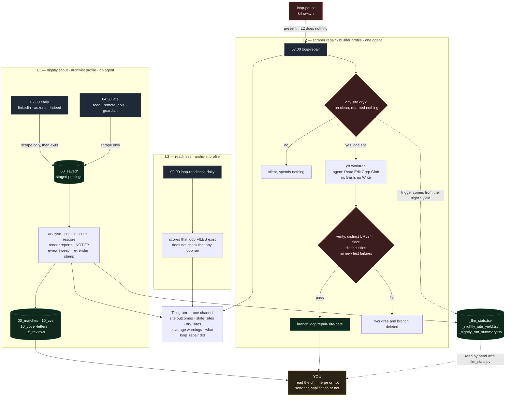
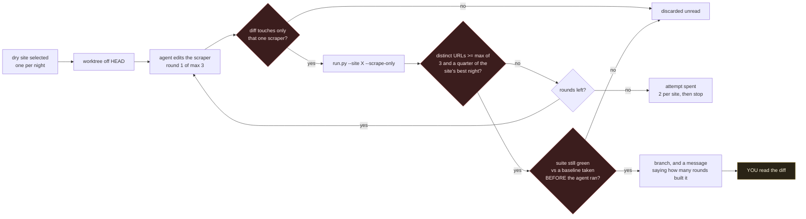

# Loop Diagram — Job Intelligence System

The pictures for [LOOP.md](LOOP.md), kept separate so the diagrams can be
redrawn without touching the configuration they describe, and so a reader who
wants the shape does not have to scroll past it to reach the numbers.

Rendered with `mermaid-cli` before committing rather than eyeballed:

```bash
npx -y @mermaid-js/mermaid-cli@11 -i loop-diagram.md -o /tmp/loop-diagram.svg
```

## The whole night

Three scheduled things run against this repo. Only one of them writes code, and
none of them finishes a decision — every path ends at a human or at a file a
human reads. Times are JST; the machine is `Asia/Tokyo`.



Read the picture for two things.

**Every arrow into `YOU` is a stop, not a handoff.** L1 ends at generated
documents; nothing sends them. L2 ends at a branch; nothing merges it. The
system has no path to the outside world that does not pass through a person.

**L2 is one narrow arrow.** It fires only when a scraper ran clean and returned
nothing, touches one scraper file, and is discarded unread if the diff reaches
anything else. It has never fired in production — `git branch --list "loop/*"`
is empty — because nothing has broken. Dormant is the expected state.

The loop that has actually changed this system is not on the diagram, because it
runs on human attention rather than on cron: something gets measured into
`_llm_stats.tsv` or into `STATE.md`, a person reads it, and a change follows.
Every weight, gate and provider decision in the git log arrived that way. The
scheduled loops feed it; they do not replace it.

## L2 in detail

The gate is the whole design, so it is worth seeing on its own. `count > 0` was
the first version, and an agent passes that by fabricating one record.



The round count is on the branch message deliberately: the worktree is not reset
between rounds, so a branch built in two rounds can carry round one's wrong edit
beside round two's fix, and nothing rejects a leftover that merely looks
harmless. No production branch has been built in two rounds yet. The first one
is worth reading closely.
